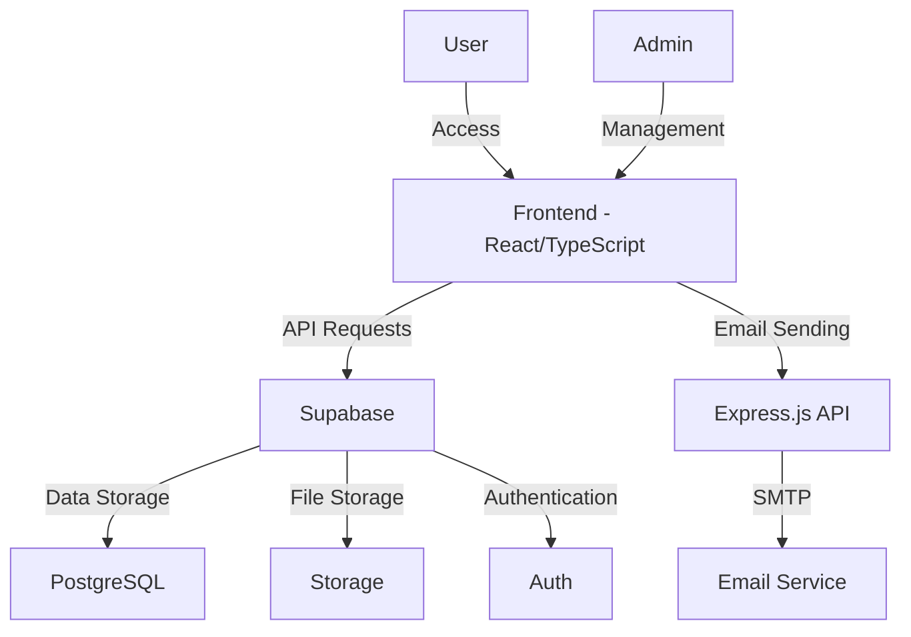

# Beşiktaş Eagles Association Website

The official website of Beşiktaş Eagles Association. A modern web application showcasing the association's activities, events, and gallery.

## About the Project

This website is designed to strengthen the online presence of Beşiktaş Eagles Association. The site includes information about the association, announcements, activities, gallery, and contact sections. It features a comprehensive admin panel for content management and an integrated system to track visitor statistics.

## Features

### Public Features
- Responsive design optimized for all devices (mobile, tablet, desktop)
- Home page with hero section, features, and recent activities
- About page with mission, vision, and values
- Board members page with detailed profiles
- Activities/events listing with detailed view
- Gallery with categorized images
- Press coverage section
- Contact form with validation
- Membership application form
- Accessibility controls (font size, high contrast, reduced motion)

### Admin Panel Features
- Secure authentication system
- Dashboard with statistics
- Activities management (add, edit, delete)
- Gallery management (image upload, categorization)
- Press releases management
- Board members management
- Contact messages management
- Membership applications processing
- User profile management

## Technology Stack

### Frontend
- **Framework:** React 18 with TypeScript
- **Build Tool:** Vite
- **Styling:** Tailwind CSS
- **UI Components:** NextUI, Framer Motion
- **Routing:** React Router DOM
- **Form Management:** React Hook Form
- **Icons:** Lucide React

### Backend
- **Database & Authentication:** Supabase
- **File Storage:** Supabase Storage
- **API Services:** Express.js
- **Email Service:** Node.js with Nodemailer

### Testing & Quality
- **Unit Testing:** Vitest
- **Component Testing:** React Testing Library
- **E2E Testing:** Cypress
- **Linting:** ESLint
- **Formatting:** Prettier
- **Git Hooks:** Husky

## Architecture



## Installation

1. Clone the repository
```bash
git clone https://github.com/username/bjk-project.git
cd bjk-project
```

2. Install dependencies
```bash
npm install
```

3. Create .env file
```
# Supabase Configuration
VITE_SUPABASE_URL=your_supabase_url
VITE_SUPABASE_ANON_KEY=your_supabase_anon_key

# API Settings
PORT=3001
CORS_ORIGIN=http://localhost:5173
NODE_ENV=development

# Email Settings (optional for development)
EMAIL_HOST=smtp.example.com
EMAIL_PORT=587
EMAIL_SECURE=false
EMAIL_USER=your_email@example.com
EMAIL_PASSWORD=your_email_password
EMAIL_FROM_NAME=Beşiktaş Eagles Association
EMAIL_FROM_ADDRESS=info@example.com
```

4. Supabase setup
   - Create your Supabase project (https://supabase.com)
   - Run the SQL files in the `supabase/migrations` folder in the Supabase SQL Editor
   - Create a bucket named "bjk-storage" for file storage
   - Create folders named "gallery" and "activities"

5. Create admin user
```bash
npm run create-admin admin@example.com your-secure-password
```

6. Start the development server
```bash
# To start only the frontend
npm run dev

# To start both frontend and backend (email API) servers
npm run dev:all
```

## Project Structure

```
src/
├── components/         # Reusable UI components
├── pages/              # Page components
├── utils/              # Helper functions and API
│   └── supabase.ts     # Supabase configuration and API functions
├── server/             # Backend server
│   ├── index.ts        # Express server
│   └── routes/         # API endpoints
├── services/           # Services (email, etc.)
├── assets/             # Static files (images, fonts, etc.)
├── contexts/           # React contexts
├── hooks/              # Custom React hooks
├── types/              # TypeScript type definitions
└── data/               # Static data files

supabase/
├── migrations/         # Database migration files
```

## Performance and Accessibility

The project implements several performance optimizations:
- Lazy loading of components and images
- Code splitting for reduced bundle size
- Image optimization (WebP format, size optimization)
- Critical CSS path optimization
- CDN usage for large media content

Accessibility features include:
- Font size controls
- High contrast mode
- Reduced motion option
- Keyboard navigation support
- ARIA attributes
- Screen reader compatibility

## Testing

Run the test suite with:

```bash
# Run unit and component tests
npm run test

# Run tests in watch mode
npm run test:watch

# Generate test coverage report
npm run test:coverage

# Run end-to-end tests
npm run test:e2e
```

## Deployment

For detailed deployment instructions, see the `DOCS/DEPLOYMENT.md` file. The project supports:
- Vercel deployment
- Netlify deployment
- Manual deployment to custom servers

## Documentation

Detailed documentation about the project is available in the `DOCS` folder:
- `KURULUM.md` - Installation and development steps
- `API_VE_VERI_MODELI.md` - API and data model explanations
- `YONETIM_PANELI.md` - Admin panel user guide
- `DEPLOYMENT.md` - Deployment and production environment configuration

## Future Improvements

Planned improvements include:
- Enhanced security measures
- Two-factor authentication
- Performance optimizations
- SEO improvements
- Additional analytics features

## Contributing

Contributions are welcome! Please feel free to submit a Pull Request.

1. Fork the repository
2. Create your feature branch (`git checkout -b feature/amazing-feature`)
3. Commit your changes (`git commit -m 'Add some amazing feature'`)
4. Push to the branch (`git push origin feature/amazing-feature`)
5. Open a Pull Request

## License

This project is licensed under the MIT License - see the LICENSE file for details.

## Contact

For technical support and questions: info@besiktaskartallaridernegi.com
